# Examen-Primer-Parcial de Americo Lovera Garcia

## Descripción de los Servicios

### 1. PostgreSQL
PostgreSQL es un sistema de gestión de bases de datos relacionales de código abierto. En esta configuración, se utiliza para almacenar datos estructurados.

### 2. MongoDB
MongoDB es una base de datos NoSQL orientada a documentos. Permite almacenar datos en formato JSON y es altamente escalable.

### 3. Mongo Express
Mongo Express es una interfaz web para administrar bases de datos MongoDB. Proporciona una interfaz gráfica para gestionar colecciones, documentos y realizar operaciones CRUD.

### 4. Nginx
Nginx es un servidor web de alto rendimiento que también puede funcionar como proxy inverso, balanceador de carga y caché HTTP.

## Configuración Docker Compose

```yaml
version: '3.8'

services:
  postgres:
    image: postgres:latest
    container_name: postgres_db
    environment:
      POSTGRES_USER: postgres
      POSTGRES_PASSWORD: 4582
      POSTGRES_DB: mydb
    ports:
      - "5432:5432"
    volumes:
      - postgres_data:/var/lib/postgresql/data
    networks:
      - app_network

  mongodb:
    image: mongo:latest
    container_name: mongodb
    environment:
      MONGO_INITDB_ROOT_USERNAME: admin
      MONGO_INITDB_ROOT_PASSWORD: 4582
    ports:
      - "27017:27017"
    volumes:
      - mongodb_data:/data/db
    networks:
      - app_network

  mongo-express:
    image: mongo-express:latest
    container_name: mongo_express
    environment:
      ME_CONFIG_MONGODB_SERVER: mongodb
      ME_CONFIG_MONGODB_PORT: 27017
      ME_CONFIG_MONGODB_ADMINUSERNAME: admin
      ME_CONFIG_MONGODB_ADMINPASSWORD: 4582
      ME_CONFIG_BASICAUTH_USERNAME: admin
      ME_CONFIG_BASICAUTH_PASSWORD: 4582
    ports:
      - "8081:8081"
    depends_on:
      - mongodb
    networks:
      - app_network

  nginx:
    image: nginx:latest
    container_name: nginx_server
    ports:
      - "80:80"
    volumes:
      - ./nginx/conf.d:/etc/nginx/conf.d
      - ./nginx/html:/usr/share/nginx/html
    networks:
      - app_network

networks:
  app_network:
    driver: bridge

volumes:
  postgres_data:
  mongodb_data:
```

## Instrucciones de Acceso

### 1. Acceso a PostgreSQL
Para acceder a la base de datos PostgreSQL:
```bash
docker exec -it postgres_db psql -U postgres
```
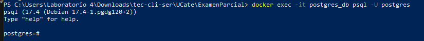

Comandos útiles dentro de PostgreSQL:
```sql
\l  -- listar todas las bases de datos
\c mydb  -- conectarse a la base de datos mydb
\dt  -- listar todas las tablas
\q  -- salir de PostgreSQL
```
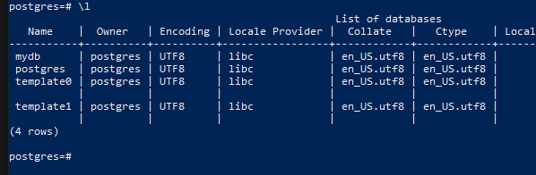

#### Crear la base de datos Colegios en PostgreSQL:
```sql
create database colegios;
\c colegios  -- conectarse a la base de datos colegios
```
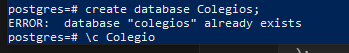

#### Crear la tabla Estudiantes en PostgreSQL:
```sql
create table estudiantes (
    id serial primary key,
    nombre varchar(100) not null,
    apellido varchar(100) not null,
    edad integer,
    grado varchar(20),
    email varchar(255),
    fecha_ingreso date,
    activo boolean default true
);
```

#### Insertar datos de ejemplo en la tabla Estudiantes:
```sql
insert into estudiantes (nombre, apellido, edad, grado, email, fecha_ingreso) 
values 
    ('Juan', 'Pérez', 15, '10°', 'juan@colegio.com', '2023-01-15'),
    ('María', 'González', 16, '11°', 'maria@colegio.com', '2023-01-15'),
    ('Carlos', 'López', 14, '9°', 'carlos@colegio.com', '2023-01-15');
```

#### Ver datos en PostgreSQL:
```sql
select * from estudiantes;
```
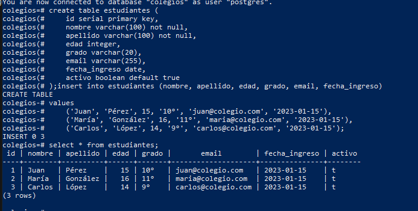

### 2. Acceso a MongoDB
Para acceder a MongoDB:
```bash
docker exec -it mongodb mongosh -u admin -p 4582
```

#### Comandos básicos de MongoDB:
```javascript
show dbs  -- Mostrar todas las bases de datos
use Colegios  -- Crear o seleccionar la base de datos Colegios
show collections  -- Mostrar todas las colecciones de la base de datos actual
```
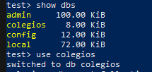

#### Crear la colección Estudiantes:
```javascript
db.createCollection("Estudiantes")
```

#### Insertar documentos en la colección Estudiantes:
```javascript
db.Estudiantes.insertMany([
    {
        nombre: "Juan",
        apellido: "Pérez",
        edad: 15,
        grado: "10°",
        email: "juan@colegio.com",
        fecha_ingreso: new Date("2023-01-15"),
        activo: true
    },
    {
        nombre: "María",
        apellido: "González",
        edad: 16,
        grado: "11°",
        email: "maria@colegio.com",
        fecha_ingreso: new Date("2023-01-15"),
        activo: true
    },
    {
        nombre: "Carlos",
        apellido: "López",
        edad: 14,
        grado: "9°",
        email: "carlos@colegio.com",
        fecha_ingreso: new Date("2023-01-15"),
        activo: true
    }
])
```
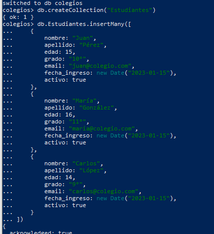

#### Consultar documentos:
```javascript
db.Estudiantes.find()  -- Ver todos los documentos
```
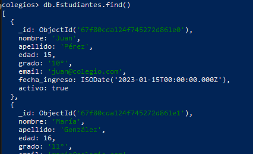

### 3. Acceso a Mongo Express
Mongo Express es accesible a través del navegador web:
```
http://localhost:8081
```

Credenciales:
- Usuario: admin
- Contraseña: 4582

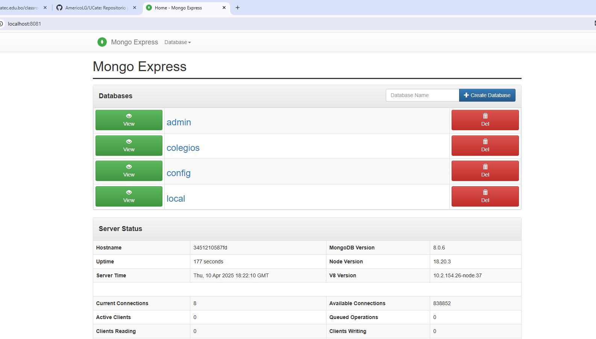

### 4. Acceso a Nginx
Para acceder al contenedor de Nginx:
```bash
docker exec -it nginx_server /bin/bash
```
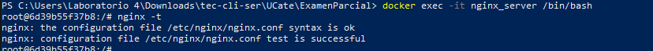

Para verificar la configuración de Nginx:
```bash
nginx -t  -- Verificar la sintaxis de la configuración
```

## Comandos Útiles Generales

Para ver el estado de los contenedores:
```bash
docker ps
```
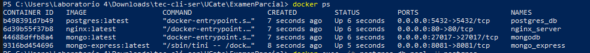

Para iniciar todos los servicios:
```bash
docker-compose up -d
```
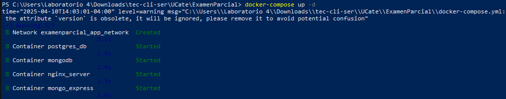

Para detener todos los servicios:
```bash
docker-compose down
```
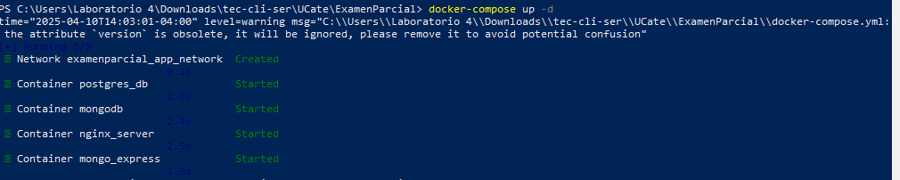

Para ver los logs de un contenedor específico:
```bash
docker logs postgres_db  -- Para ver logs de PostgreSQL
docker logs mongodb  -- Para ver logs de MongoDB
docker logs mongo_express  -- Para ver logs de Mongo Express
docker logs nginx_server  -- Para ver logs de Nginx
```
